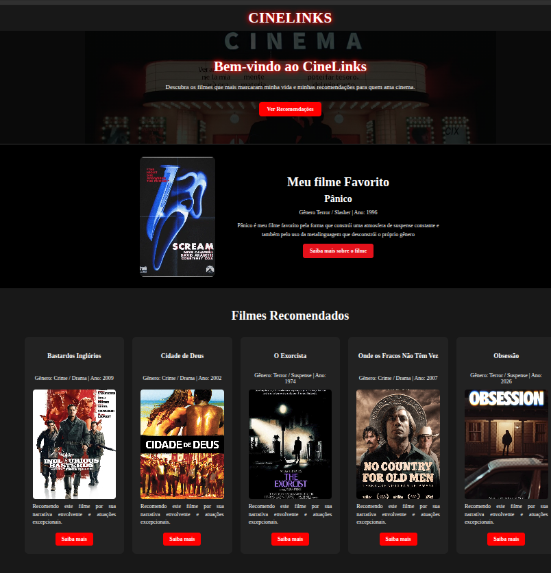

# CineLinks

CineLinks é uma página web de recomendações de filmes criada como projeto de aprendizagem em HTML, CSS e JavaScript.

O site reúne alguns dos meus filmes favoritos, informações sobre cada obra, links relacionados e uma seção pessoal sobre meu gosto por cinema.

## Preview



## Objetivo do projeto

O objetivo do projeto é praticar os principais conceitos de desenvolvimento web front-end, incluindo:

- estruturação de páginas com HTML semântico;
- estilização com CSS;
- criação de layouts responsivos;
- uso de Flexbox e Grid;
- implementação de tema claro e escuro;
- interações com JavaScript;
- organização de arquivos e versionamento com Git e GitHub.

## Funcionalidades

- Tema claro e escuro;
- Salvamento do tema escolhido no navegador;
- Layout responsivo para diferentes tamanhos de tela;
- Seção de filme favorito;
- Lista de filmes recomendados;
- Links externos para páginas dos filmes;
- Links para GitHub e Instagram;
- Efeitos de hover e animações;
- Navegação suave até a seção de recomendações.

## Tecnologias utilizadas

- HTML5
- CSS3
- JavaScript
- Git
- GitHub

## Estrutura do projeto

```text
CineLinks/
├── assets/
├── index.html
├── style.css
├── script.js
├── README.md
└── uso-de-ia.md
```

## Como executar o projeto

1. Clone este repositório.
2. Abra a pasta do projeto no Visual Studio Code.
3. Abra o arquivo `index.html` no navegador.

Também é possível utilizar a extensão Live Server do VS Code para executar o projeto localmente.

## Aprendizados

Durante o desenvolvimento do CineLinks, foram praticados conceitos fundamentais de desenvolvimento web, como:

- Estruturação de páginas utilizando HTML semântico;
- Estilização de elementos com CSS;
- Criação de layouts com Flexbox e Grid;
- Desenvolvimento de páginas responsivas;
- Manipulação de classes e eventos com JavaScript;
- Implementação de tema claro e escuro;
- Utilização do `localStorage` para armazenar a preferência de tema;
- Criação de efeitos de hover e transições;
- Organização e versionamento do projeto com Git e GitHub.

## Autor

Desenvolvido por **Mateus Araújo** como parte dos estudos de desenvolvimento web.

[GitHub](https://github.com/mateusvsaraujo2-Slyter)